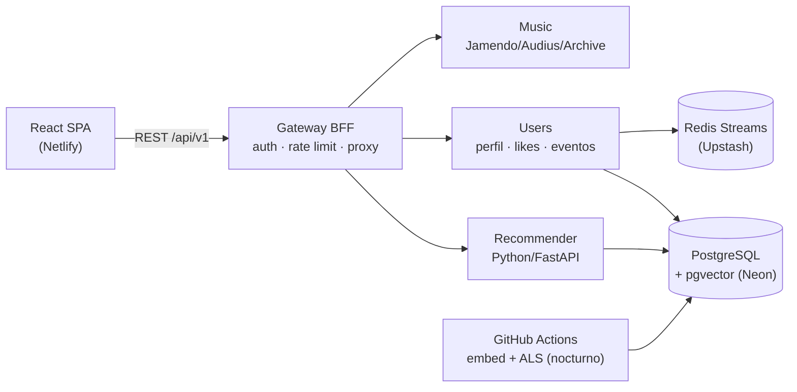

# SoundMind 🎵

> Plataforma de streaming de **música libre** (Creative Commons, artistas independientes y dominio público) con perfil de usuario, historial reproducible y un **motor de recomendación híbrido propio basado en IA** — contenido + colaborativo + contexto, con recomendaciones **explicables**.

[](.github/workflows/ci.yml)
[](.github/workflows/codeql.yml)
[](.github/workflows/ci.yml)
[](LICENSE)
[](tsconfig.json)
[](services/recommender)

**▶️ Demo en vivo: <https://mariadsalazar.github.io/soundmind/>** · API: `https://soundmind-gateway.onrender.com`

> 💤 Los servicios corren en free tier y se duermen; la primera carga puede tardar ~30 s en despertar.

## ¿Por qué este proyecto?

Tras el cierre de la API de recomendaciones de Spotify (2024–2026), construir un recomendador musical con **datos y APIs abiertas** es un reto técnico real. SoundMind lo resuelve con:

- 🎧 **Streaming 100% legal**: catálogo Creative Commons de [Jamendo](https://www.jamendo.com), artistas independientes de [Audius](https://audius.co) y dominio público / netlabels del [Internet Archive](https://archive.org) — **streaming completo**. Nunca se almacena ni se hace proxy de audio (solo URLs oficiales de cada CDN). La legalidad se impone en toda la cadena: búsqueda, eventos y recomendaciones (con `CHECK` en la base).
- 👤 **Perfil y eventos** (F2): cuentas con JWT, likes, historial **reproducible** y eventos a Redis Streams — con **consentimiento explícito** (GDPR) y borrado total de cuenta.
- 🧠 **IA híbrida propia** (F3 + F4): embeddings de contenido + filtrado colaborativo (ALS) + re-ranking contextual, con recomendaciones **explicables** ("Porque escuchaste X", "Oyentes como tú…", "A esta hora sueles escuchar esto").
- 💸 **Costo $0**: todo corre en free tiers y open source.

> ℹ️ **Sobre el catálogo comercial**: la música de major label no está disponible gratis y legalmente en ninguna API. SoundMind prioriza la legalidad por diseño; el catálogo comercial completo queda como evolución futura vía el SDK oficial de Spotify (cuenta Premium del usuario). Decisiones en [`docs/adr`](docs/adr) (ADR-006 a ADR-013).

## Arquitectura

Microservicios ligeros con **Clean / Hexagonal Architecture**. Diagramas C4 en
[`docs/C4-DIAGRAMAS.md`](docs/C4-DIAGRAMAS.md); narrativa completa en
[`docs/ARQUITECTURA.md`](docs/ARQUITECTURA.md) y los diseños por fase
([F2](docs/F2-DISENO-USERS.md) · [F3](docs/F3-DISENO-RECOMMENDER.md) · [F4](docs/F4-DISENO-RECOMMENDER-V2.md)).



| Workspace | Rol | Stack |
|---|---|---|
| `apps/web` | SPA (auth, búsqueda, player, likes, historial, "Para ti") | React 19 + TypeScript + Vite + Tailwind 4 + Zustand + TanStack Query |
| `services/gateway` | BFF: auth, rate limit, proxy, cuenta | Node 22 + Express 5 + JWT RS256 + Argon2id + PostgreSQL + Redis |
| `services/music` | Catálogo y búsqueda multi-fuente | Node 22 + Express 5 + Zod |
| `services/users` | Perfil, likes, historial, eventos de escucha | Node 22 + Express 5 + PostgreSQL (Neon) + Redis Streams (Upstash) |
| `services/recommender` | **IA híbrida** (serving): coseno + producto interno en pgvector | Python 3.11 + FastAPI + pgvector |
| `jobs/embed`, `jobs/collab` | Batch nocturno (GitHub Actions): embeddings + ALS | Python (sentence-transformers, implicit) |
| `packages/shared` | Tipos de dominio compartidos | TypeScript |

**Patrones aplicados** (buscar `PATTERN:` / `# PATTERN:` en el código): Hexagonal Ports & Adapters, BFF, Adapter, Facade, Factory Method, Repository, Observer, **Event-Driven** (Redis Streams) y **event sourcing ligero** (snapshot inmutable de la pista en cada evento → historial reproducible).

## 🧠 El motor de recomendación

Modelo **híbrido en tres señales**, con el patrón **entrenar pesado / servir ligero**:
el entrenamiento (torch, ALS) corre en **GitHub Actions** y escribe vectores en
pgvector; el servicio FastAPI en Render solo ejecuta álgebra de vectores (no lleva
torch — no cabría en 512 MB). Ver [ADR-012](docs/adr/ADR-012-recommender-v1-batch-embeddings.md)
y [ADR-013](docs/adr/ADR-013-recommender-v2-colaborativo-hibrido.md).

| Señal | Cómo | Explicación al usuario |
|---|---|---|
| **Contenido** (F3) | embeddings de texto (`all-MiniLM-L6-v2`, 384-d) + coseno `<=>` | "Porque escuchaste X" |
| **Colaborativo** (F4) | ALS (`implicit`) → factores latentes + producto interno `<#>` | "Oyentes como tú lo escuchan" |
| **Contextual** (F4) | re-ranking por hora típica y racha de skips | "A esta hora sueles escuchar esto" |

El score final mezcla las señales con **fallback a contenido** cuando el
colaborativo no tiene datos, y resuelve el **cold start** con un onboarding de
géneros. Cada recomendación incluye un `reason` que la UI traduce a lenguaje
humano — diferenciador frente a las cajas negras comerciales.

## Funcionalidades

- 🔎 Búsqueda multi-fuente con intercalado round-robin que preserva la relevancia de cada API.
- ▶️ Reproductor con cola, anterior/siguiente, volumen y registro automático de escuchas.
- 👤 Registro / login (JWT RS256, refresh token rotativo en cookie `HttpOnly`, **store en Redis**).
- ❤️ Likes y **"Mi historial" reproducible** (cada evento guarda un snapshot de la pista).
- ✨ **"Para ti"** (recomendaciones híbridas), **"Más como esta"** y **onboarding de géneros**, con el *porqué* por pista.
- 🔒 Toggle de **consentimiento** de tracking y borrado de cuenta (`DELETE /me`, `ON DELETE CASCADE`).

## Quick start

```bash
# 1. Instalar dependencias
npm install

# 2. Configurar entorno
cp .env.example .env
#   - JAMENDO_CLIENT_ID: API key gratis en https://devportal.jamendo.com/
#   - DATABASE_URL: PostgreSQL con pgvector (Neon free tier)
#   - REDIS_URL:    Redis (Upstash free tier)

# 3. Aplicar migraciones (crea tablas + extensión pgvector)
node --env-file=.env scripts/_apply-migrations.mjs

# 4. Levantar todo (gateway :4000, music :4002, users :4003, web :5173)
npm run dev
```

Abre <http://localhost:5173>, crea una cuenta, busca algo (ej. "lofi") y reproduce. 🎶
El **Recommender** (Python) y los **batch** son opcionales en local — ver
[`services/recommender/README.md`](services/recommender/README.md).

## Deploy (free tier)

| Pieza | Plataforma | Cómo |
|---|---|---|
| `apps/web` | **Netlify** | [`netlify.toml`](netlify.toml) define build y redirects SPA. Configurar `VITE_API_URL`. |
| `gateway` · `music` · `users` | **Render** | [`render.yaml`](render.yaml): 3 servicios Docker con healthchecks y autodeploy. |
| `recommender` | **Render** (Python) | Root `services/recommender`; `uvicorn app.main:app`. Ver su README. |
| `embed` · `collab` | **GitHub Actions** | Workflow `train-recommender` (cron nocturno + manual). Secret `DATABASE_URL`. |
| Base de datos / cola | **Neon** (PostgreSQL + pgvector) + **Upstash** (Redis) | Free tier. |

### Gotchas de deploy aprendidos (importante)

- 🔑 **Claves JWT en Render**: el panel rompe los PEM multilínea. El código acepta el PEM **en base64** (recomendado) o en una línea con `\n`:
  ```bash
  openssl genpkey -algorithm RSA -pkeyopt rsa_keygen_bits:2048 -out jwt-private.pem
  openssl pkey -in jwt-private.pem -pubout -out jwt-public.pem
  base64 -w0 jwt-private.pem   # → JWT_PRIVATE_KEY (gateway)
  base64 -w0 jwt-public.pem    # → JWT_PUBLIC_KEY  (gateway, users y recommender, el mismo)
  ```
- 🐘 **`DATABASE_URL`**: usar solo `?sslmode=require`. Quitar `&channel_binding=require` — rompe el driver `pg` en el Docker de Render.
- 🐍 **Python en Render**: fijar la versión con `.python-version` (3.12 da error con numpy/pgvector; el job ALS usa 3.11 porque `implicit` no tiene wheel para 3.12).
- 🌐 **CORS / cookies**: `CORS_ORIGINS` (gateway) → URL de Netlify; cookie de refresh `SameSite=None; Secure` en prod.
- 💤 **Cold start**: el free tier de Render duerme tras 15 min — [UptimeRobot](https://uptimerobot.com) hace ping a `/healthz` cada 5 min. Los monitores mandan `HEAD`, así que `/healthz` acepta `GET` **y** `HEAD`.

## Scripts

| Comando | Qué hace |
|---|---|
| `npm run dev` | Levanta los 4 servicios Node/web en paralelo |
| `npm run typecheck` | TypeScript estricto en todos los workspaces |
| `npm test` | Tests unitarios (Vitest); el recommender usa `pytest` |
| `npm run test:coverage` | Cobertura de **dominio + aplicación** con umbral 80% (CI la exige) |
| `node --env-file=.env scripts/_apply-migrations.mjs` | Aplica las migraciones SQL |

## 💡 Lo que aprendí / trade-offs

- **El free tier es un requisito de diseño, no un límite molesto.** No poder meter
  torch en 512 MB forzó la mejor decisión de la arquitectura: **entrenar pesado en
  GitHub Actions, servir ligero en pgvector**. El serving quedó minúsculo y rápido.
- **La Arquitectura Hexagonal se pagó sola.** Cambiar el repositorio de usuarios de
  in-memory → Postgres, el refresh-store → Redis, y la recomendación de contenido →
  híbrida se hizo tocando un adaptador y un caso de uso, con los tests intactos.
- **Ser honesto con datos escasos.** Con pocos usuarios el colaborativo es casi
  ruido; en vez de fingir señal, el híbrido **cae a contenido** y el sistema sigue
  siendo útil. El entregable es la arquitectura lista que mejora sola con volumen.
- **Compilar no es verificar.** Los bugs que importaron solo aparecieron contra la
  realidad: un `ORDER BY` con alias que daba 500 (visto al correr la query en la DB
  real), un `/healthz` que rechazaba `HEAD` (visto al configurar el monitor), claves
  JWT que el panel rompía. Verificar en producción, no solo `typecheck`.
- **Coherencia de una decisión en toda la cadena.** "Solo fuentes legales" no es un
  comentario: se impone en la búsqueda, en la ingesta de eventos y en el corpus de
  IA, con un `CHECK` que lo blinda en la base.

## Créditos y licencias de recursos

- Iconos UI: [Lucide](https://lucide.dev) (ISC). Música: [Jamendo](https://devportal.jamendo.com/) (CC), [Audius](https://docs.audius.org/api/) (indie), [Internet Archive](https://archive.org) (dominio público). Embeddings: [`sentence-transformers`](https://www.sbert.net/). **Sin assets generados por IA.**

## Roadmap

- [x] **F1 — MVP catálogo**: búsqueda multi-fuente + reproducción + auth JWT + deploy
- [x] **F1.5 / F1.6 — Catálogo solo-legal**: + Internet Archive; retirados Deezer y JioSaavn (ADR-009/010/011)
- [x] **F2 — Perfil y eventos**: registro/login, likes, historial reproducible, Redis Streams, PostgreSQL, consentimiento (GDPR) — **desplegado**
- [x] **F3 — IA de contenido**: embeddings + "más como esta" + onboarding — **desplegado**
- [x] **F4 — IA híbrida**: colaborativo (ALS) + re-ranking contextual + explicabilidad — **desplegado**
- [x] **F5 — Pulido**: diagramas C4, Dependabot + CodeQL, README + demo en vivo, cobertura de dominio >80% (CI la exige) y `npm audit` limpio

## Licencia

[MIT](LICENSE) © 2026 Maria del Carmen Salazar Torres
