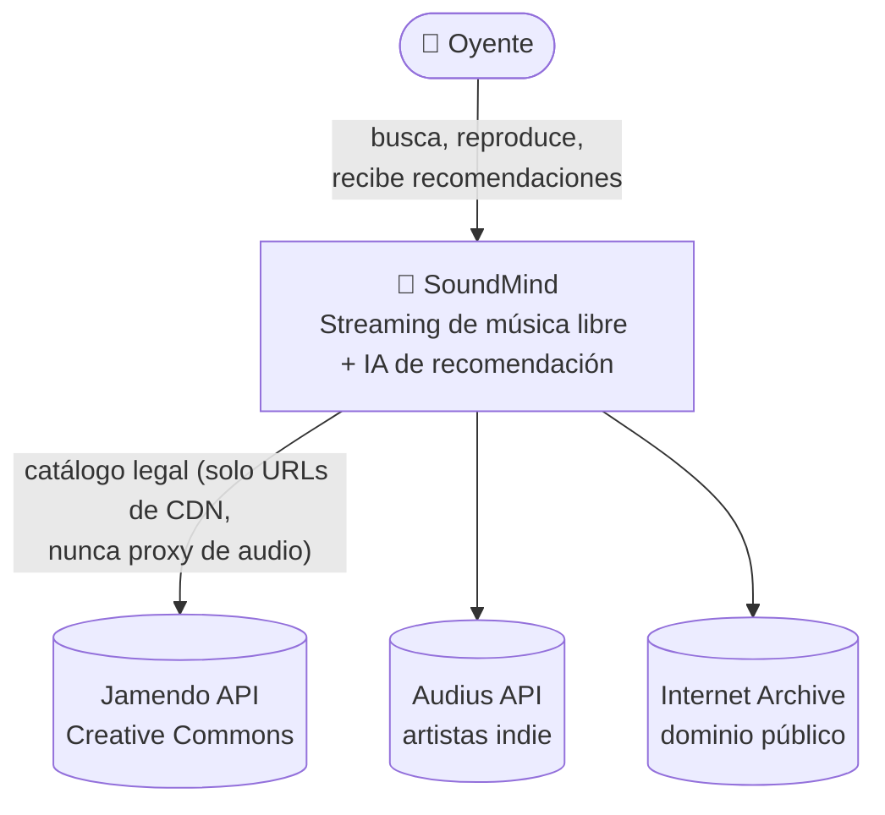
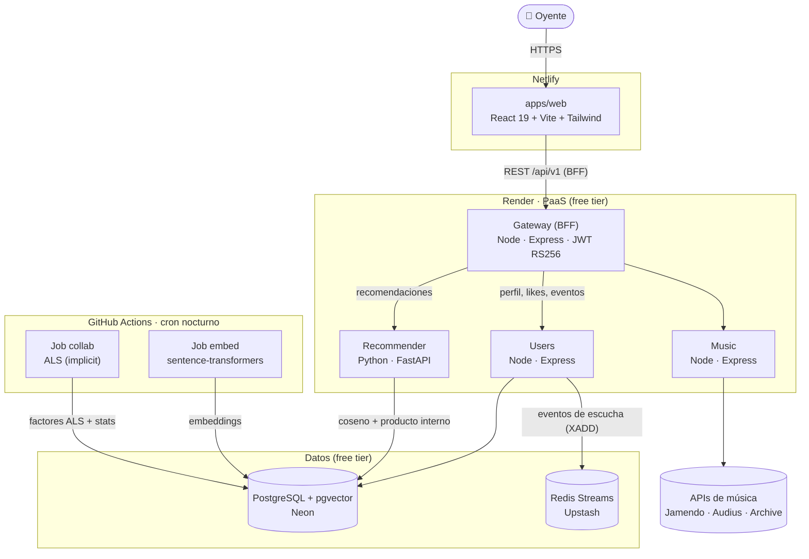
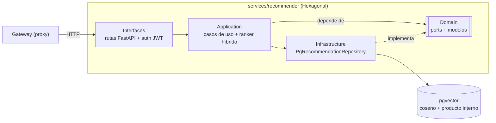

# Diagramas C4 — SoundMind

Arquitectura en tres niveles del modelo [C4](https://c4model.com) (contexto →
contenedores → componentes). Diagramas en Mermaid: GitHub los renderiza solos.
Complementan la narrativa de [`ARQUITECTURA.md`](ARQUITECTURA.md).

## Nivel 1 — Contexto

Qué es SoundMind y con quién/qué habla.

## Nivel 2 — Contenedores

Las piezas desplegables y cómo se comunican. El **entrenamiento pesado** (torch,
ALS) vive en GitHub Actions; el **serving** en Render es ligero (solo álgebra en
pgvector). Ver [ADR-012](adr/ADR-012-recommender-v1-batch-embeddings.md) y
[ADR-013](adr/ADR-013-recommender-v2-colaborativo-hibrido.md).

## Nivel 3 — Componentes (Recommender)

El servicio que mejor muestra la **Arquitectura Hexagonal (Ports & Adapters)**:
el dominio define puertos; la infraestructura los implementa; los casos de uso no
saben que detrás hay pgvector.

> El **ranker híbrido** combina contenido (coseno de `taste_vec`) + colaborativo
> (producto interno de factores ALS) con fallback a contenido, y re-rankea por
> contexto (hora, skips). Lógica de dominio pura y testeada.
